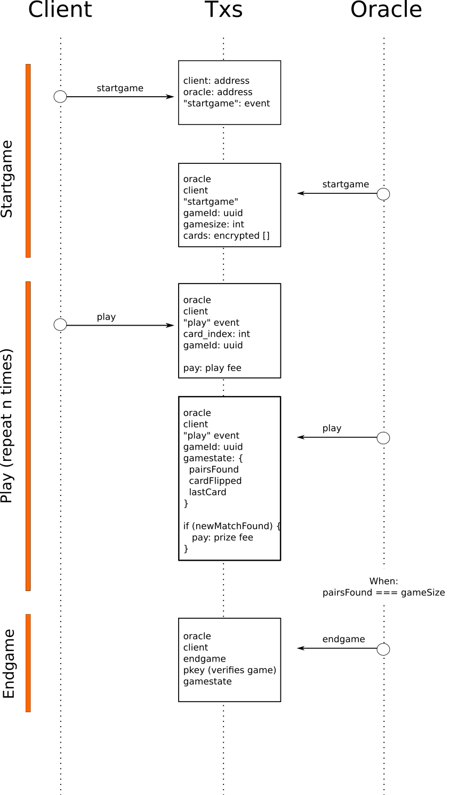

# SVPAIRS


SVPairs is a simple pairs card game running on the blockchain.
An Oracle deals card shuffles and posts game-state updates on-chain.
The user interacts with the game by posting actions on transactions.
The user also pays a small fee to flip cards, when a match is found the Oracle pays the user a reward instead.

## Install

```
create `./configs.json` with
{
  "oraclePrivate": "",  // oracle private key
  "oraclePublic": "",   // oracle public key
  "receiveAddress": ""  // address to receive payments
}

cd client
npm i && npm run dev
cd oracle
npm i && npm run dev
```

## Main Concepts

* Single-player pairs game of cards played on-chain
* Client and Oracle communicate via transactions
* The oracle posts the game state on-chain and updates it as the user requests actions
* The user pays small amounts of BSV to play / flip cards.
* When the user finds a pair the Oracle pays him a prize in BSV

## Client-Oracle Protocol



## Final Notes

The application is buggy, there was little time to test it thoroughly, cleanup code etc.

- TODO The oracle should be able to reconstruct the played games by crawling the blockchain.
  When reset or started, the oracle should either terminate open games or resume them.

* TODO The cards shuffle posted at gamestart should be encrypted using the private key posted at the end.
* TODO The cost of flipping cards and pair rewards should be balanced using probabilities (close to 50/50).
* TODO Client-side error messages from the server
* TODO client-side display info on matching pair / prize received
* TODO client-side input for client payment address or fetch one from moneybutton paymail handle